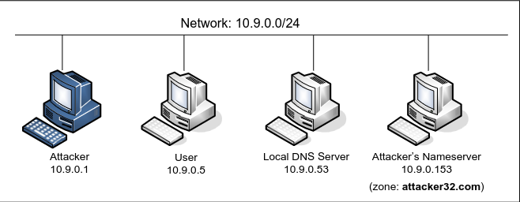
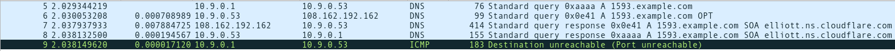
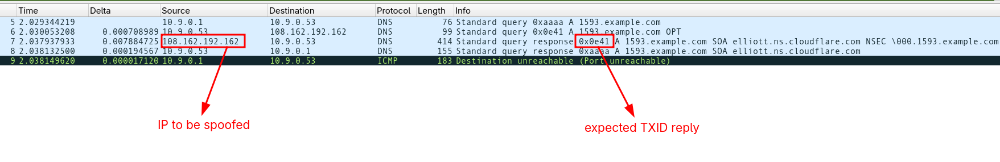

## Lab Setup




## DNS Packet

- id = txid
- qr = Query/Response flag, '0' means query
- qdcount = Question count, we are asking exactly one question
- ancount = answer count
- nscount = Number of RRs in the "Authority Section"
- arcount = Additional record count
- qd = question section (payload)

## Normal DNS Query & Reply Behaviour

To send dns request use `send_dns_query.py` or `dig` tool.




- SRC PORT: 33333
- TXID is random
- IP must be spoofed, and there are multiple ips.

## Spoofing IP

for `example.com` dns request there are multiple devices (IPs) who replies. To successfully spoof it's required.

```bash
dig ns example.com

;; ANSWER SECTION:
example.com.		75059	IN	NS	hera.ns.cloudflare.com.
example.com.		75059	IN	NS	elliott.ns.cloudflare.com.
```

```bash
dig @8.8.8.8 A hera.ns.cloudflare.com elliott.ns.cloudflare.com +short

108.162.192.162
173.245.58.162
172.64.32.162
172.64.35.228
108.162.195.228
162.159.44.228
```

## DNS Cache Poison

1. Attacker query `12345.example.com` to recursive resolver.
2. Attacker sends multiple reply, to try posion `example.com NS ns.attacker32.com`. If succeed, since `12345.example.com` not cached yet, the reply must be cached, and this will cause to overwrite the NS section for original `NS`
3. From now on any `xxxxx.example.com` query will be anwered by our `ns.attacker32.com` server, so continue this attack won't restore the legitimate NS section.


# Resources

https://seedsecuritylabs.org/Labs_20.04/Files/DNS_Remote/DNS_Remote.pdf